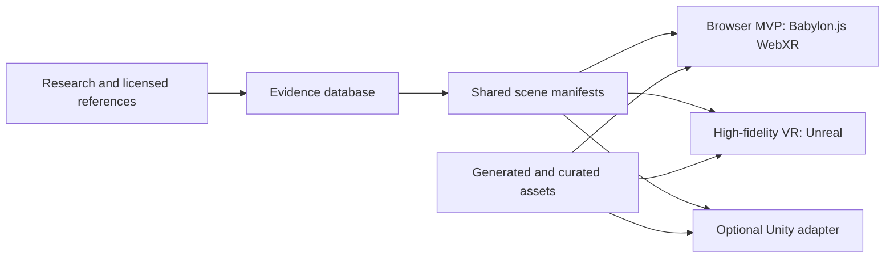

# Architecture

## One Project, Multiple Runtimes

The project is organized as one content-first production repo. Runtime apps are thin adapters over shared scene data.

## Layers

- `content/source-references`: license-reviewed references, notes, citations, and provenance.
- `content/scene-data`: route manifests, evidence levels, narration beats, and reconstruction assumptions.
- `content/generated`: AI drafts and intermediate results. This is ignored by git by default.
- `content/processed`: optimized runtime assets such as compressed textures and GLB files.
- `packages/shared-scene`: shared data contracts used by tooling and browser runtime.
- `apps/web-tour`: first playable browser target using Babylon.js, WebGL, and WebXR.
- `engines/unreal`: high-fidelity runtime target that imports the same data contract.

## Runtime Strategy

The browser MVP should prove the walkthrough design, pacing, interaction model, evidence overlay, and baseline scene composition. The Unreal target should later consume the same scene manifest and replace procedural placeholder assets with Nanite-friendly meshes, authored lighting, volumetric atmosphere, high-quality NPC animation, spatial audio, and headset-specific comfort settings.

## Evidence Model

Every important object or scene beat should carry an evidence level:

- `confirmed`: directly supported by ruins, inscriptions, excavations, or well-established scholarship.
- `inferred`: plausible from comparable sites, material culture, texts, or regional practice.
- `speculative`: cinematic reconstruction used to make the experience coherent or emotionally legible.

Evidence view is not a debug overlay. It is a trust feature.
