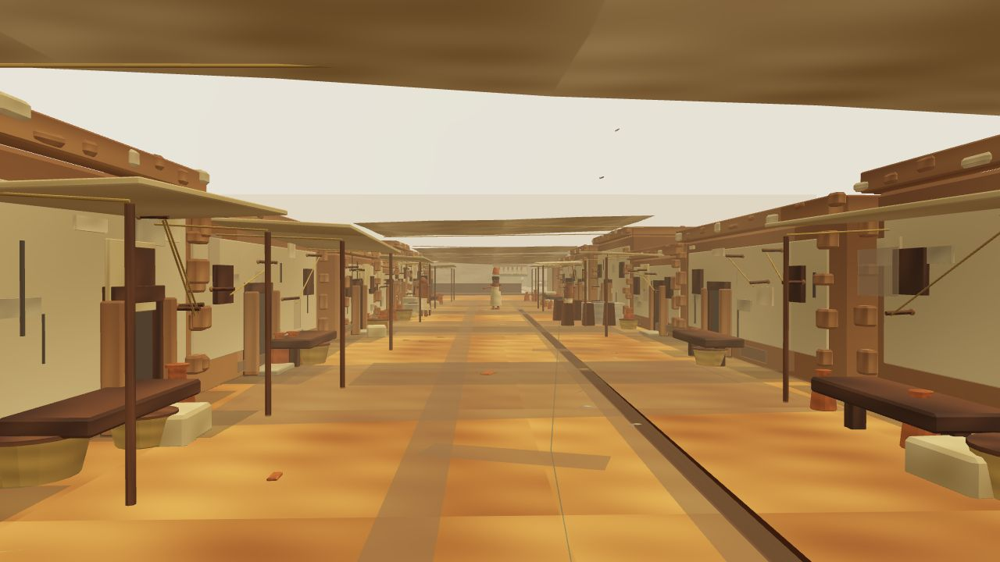

# Hero Street Art Direction v1

Goal: make one fixed eye-height street view approach the cinematic reference quality before adding more district content.

## QA Camera

Use this fixed browser URL for the main beauty benchmark:

`http://127.0.0.1:5573/?shot=hero-street-main&chrome=0`

Camera bookmark:

- Position: `[-6.6, 1.65, -18]`
- Look at: `[-6, 1.48, 8]`
- Purpose: eye-height visitor view down the dense residential lane.

Secondary diagnostic URLs:

- `http://127.0.0.1:5573/?shot=street-entry&chrome=0`
- `http://127.0.0.1:5573/?shot=hero-street-material&chrome=0`

Current captures:

- `docs/design/screenshots/street-entry-current.png`
- `docs/design/screenshots/hero-street-main-current.png`
- `docs/design/screenshots/hero-street-material-current.png`

## Side-By-Side Review

| Current main shot | Reference 1 | Reference 2 |
| --- | --- | --- |
|  |  |  |

## Reference Comparison

Use the user's cinematic references for visual direction only. Do not copy source pixels, characters, architecture, or later-period details directly.

Reference strengths to match:

- Strong foreground framing with cloth, wall edges, baskets, and people near camera.
- Warm directional sun with readable shadow shapes.
- Deep doorway darkness and strong contact shadows.
- Dusty, uneven ground with natural color variation instead of visible tile bands.
- Mudbrick/plaster walls with broken edges, stains, pitting, and occluded bases.
- Atmospheric depth: distance fades through warm dust rather than flat white fog.
- Human scale: a few readable figures close to camera are more effective than many tiny placeholders.

Current shot weaknesses:

- Exposure is too high; sky and distance are washed toward white.
- Materials are still too procedural and uniform, especially plaster and packed street dust.
- Ground reads as broad rectangular panels, not compacted earth.
- Shadow shapes are too soft and evenly spread; the image needs clearer sun direction and darker interior pockets.
- Facades repeat too regularly and still feel modular.
- Foreground lacks a strong close object/person silhouette comparable to the references.
- Color is dominated by one yellow-brown range; the target needs warmer sun, cooler shadow, darker dirt, pale linen, red clay pottery, and occasional muted reed/wood accents.

## Target Paintover Spec

Think of the next pass as a paintover translated into assets and shaders:

1. Darken the top canopy and use it as a strong foreground shadow frame.
2. Pull the eye down the center lane with a darker, irregular walking path and brighter sun strips.
3. Break the ground tile look with one continuous authored hero-road atlas: dust, footprints, pebble clusters, wheel/drag ruts, straw, pottery chips, and wall-base grime.
4. Push doorway interiors nearly black, with warm reflected edges around the jambs.
5. Add localized AO around all wall bases, benches, jars, poles, baskets, and feet.
6. Reduce white haze; use amber dust depth with a slightly darker sky/upper background.
7. Move visual interest closer to the camera: one foreground basket/linen shape on the left and one worker or carrier silhouette near the right third.
8. Keep Old Kingdom restraint: mudbrick domestic lane, simple plaster, linen kilts/sheath-like garments, bare feet/simple sandals, minimal jewelry.

## Material Rebuild

Replace broad procedural material response with authored atlas sets:

- `hero_mudbrick_wall`: albedo, normal, roughness, AO, dirt mask, edge-wear mask.
- `hero_cracked_plaster`: albedo, normal, roughness, AO, stain mask, crack decals.
- `hero_packed_dust_ground`: albedo, normal, roughness, AO, height, footprint/rut/debris decal layers.
- `hero_linen_canopy`: albedo, normal, roughness, translucency color, dirt gradient.
- `hero_pottery`: albedo, normal, roughness, AO, rim darkening.
- `hero_wood_reed`: albedo, normal, roughness, fiber direction.
- `hero_skin_linen_character`: simple atlas for 2-3 hero figures.

Quality bar:

- Near-camera materials should hold up at 1280x720 without looking flat.
- Visible repetition should be broken by masks, decals, and baked shadows rather than more object clutter.
- The ground and walls should look hand-authored from the hero camera, even if far areas remain simpler.

## Lighting Rebuild

Blender should author the expensive lighting for the hero shot:

- Bake sun-shadow strips from awnings and roof lips.
- Bake doorway darkness and contact AO.
- Bake prop grounding under benches, baskets, jars, poles, humans, and wall bases.
- Use a warm low sun and a cooler shadow fill.
- Export light/shadow atlases or shadow decal meshes with stable UVs.

Babylon should then:

- Lower exposure slightly.
- Increase contrast locally.
- Use warmer color grading with less white fog.
- Keep the scene readable on laptop browsers.

## Character Quality

For the next pass, do not add more people. Improve only 2-3 hero figures:

- One carrier walking down the lane.
- One worker near the right foreground.
- Optional seated/standing figure partly in shade.

Silhouette target:

- Plain linen kilt or simple sheath-like linen garment.
- Bare feet or simple sandals.
- Dark hair/simple head shape.
- Minimal jewelry.
- Slower, grounded movement.

## Acceptance Check

The pass is acceptable when `hero-street-main-current.png` can be recaptured and:

- The lane no longer reads as tiled.
- Doors and wall bases have convincing darkness.
- The canopy creates a cinematic top frame.
- At least one foreground human/prop silhouette creates scale.
- The image has stronger warm sun/cool shadow separation.
- Material realism improves before object count increases.

## Designer Input, If Available

A visual designer would be most useful for:

- One paintover of `hero-street-main-current.png`.
- A small color script: sun color, shadow color, haze color, plaster/dust/pottery/linen palette.
- Material reference board for mudbrick, plaster, dust, linen, clay, wood, reed, skin.
- A clear note on what to remove or simplify, not just what to add.

This is optional for the MVP. The first pass can be done internally from this spec.
